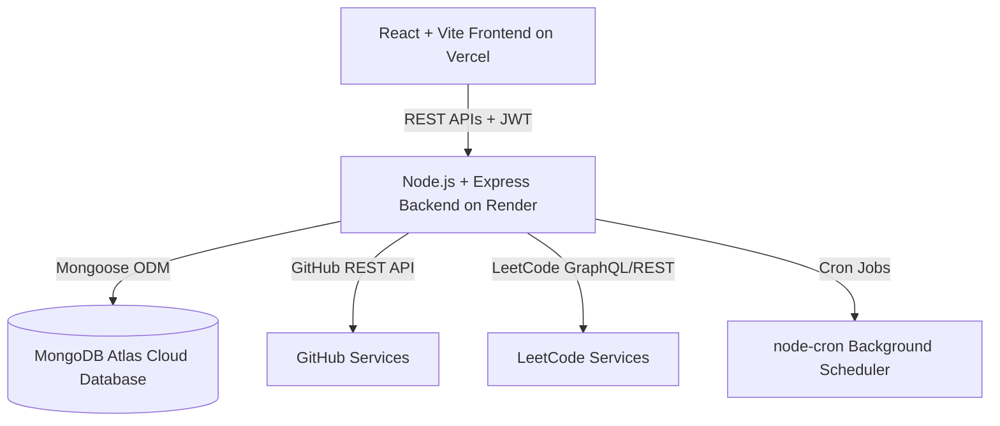

# Sri Saru Kumar S - Production Personal Portfolio Monorepo

A modern, responsive, full-stack personal portfolio and Content Management System (CMS) built for **Sri Saru Kumar S**.

## Architecture & Tech Stack



### Stack Breakdown

* **Frontend**: React, Vite, React Router v6, Axios, Tailwind CSS, Framer Motion, Lucide Icons
* **Backend**: Node.js, Express.js, MongoDB (Mongoose), JWT Auth, bcryptjs, Helmet, CORS, express-rate-limit, Zod
* **Hosting Platforms**:
  * **Database**: MongoDB Atlas
  * **Backend**: Render
  * **Frontend**: Vercel

---

## Production Deployment Guide

### 1. MongoDB Atlas Setup (Database)
1. Go to [MongoDB Atlas](https://www.mongodb.com/cloud/atlas) and create a free M0 cluster.
2. Under **Database Access**, create a database user (e.g. `portfolio_user` and password).
3. Under **Network Access**, click **Add IP Address** and select **Allow Access from Anywhere (`0.0.0.0/0`)** so Render can connect.
4. Click **Connect** → **Drivers** and copy your connection string:
   `mongodb+srv://<username>:<password>@cluster.mongodb.net/portfolio_db?retryWrites=true&w=majority`

---

### 2. Render Setup (Backend Web Service)
1. Push your repository to GitHub.
2. Sign in to [Render](https://render.com) and click **New** → **Web Service**.
3. Connect your GitHub repository.
4. Set the following settings:
   * **Root Directory**: `backend`
   * **Build Command**: `npm install`
   * **Start Command**: `npm start`
5. Under **Environment Variables**, add:
   * `NODE_ENV`: `production`
   * `MONGODB_URI`: `<Your MongoDB Atlas Connection String>`
   * `JWT_SECRET`: `<Generate a random long secret string>`
   * `FRONTEND_URL`: `https://your-portfolio-app.vercel.app`
   * `INITIAL_ADMIN_PASSWORD`: `Srisarukumar@2004`
6. Click **Deploy Web Service**.
7. Once deployed, note down your backend URL (e.g. `https://portfolio-backend-xxxx.onrender.com`).
8. To seed data in production, run `npm run seed` or run `node scripts/seed.js` inside Render's Shell tab!

---

### 3. Vercel Setup (Frontend Web Application)
1. Sign in to [Vercel](https://vercel.com) and click **Add New** → **Project**.
2. Import your GitHub repository.
3. Select the `frontend` directory as the **Root Directory**.
4. Under **Framework Preset**, select **Vite**.
5. Under **Environment Variables**, add:
   * `VITE_API_URL`: `https://your-portfolio-backend-xxxx.onrender.com/api` (Replace with your Render API backend URL)
6. Click **Deploy**.
7. Vercel will build and deploy your frontend. All multi-page SPA routes (`/about`, `/skills`, `/projects`, `/experience`, `/contact`, `/admin`) are pre-configured via `frontend/vercel.json`.

---

## Local Setup & Quickstart

1. **Install Dependencies**:
   ```bash
   npm run setup
   ```

2. **Seed Resume Data & Admin User**:
   ```bash
   npm run seed
   ```

3. **Start Concurrent Local Servers**:
   ```bash
   npm run dev
   ```
   * Public Portfolio UI: `http://localhost:5173`
   * Admin Portal: `http://localhost:5173/admin/login`
   * Backend REST API: `http://localhost:5000/api`

---

## Features & Route Access

### Public Multi-Page Routes
* `/` - Home Hero, Quick Overview, CTAs, Highlights
* `/about` - Dedicated Bio & Background Page
* `/skills` - Categorized Technical Skills Matrix with Filters
* `/projects` & `/projects/:slug` - Filterable Project Gallery & Detail Pages
* `/experience` - Work & Internship Timeline
* `/education` - Degree, Qualifications & CGPA Highlights
* `/certifications` - Verified NPTEL & Technical Certifications
* `/achievements` - Leadership & Finalist Titles
* `/coding-profiles` - Live Synchronized GitHub & LeetCode Statistics
* `/contact` - Direct Contact Hub & Form

### Protected Admin Dashboard (`/admin`)
* **Login Route**: `/admin/login` (Credentials: `srisarukumar@gmail.com` / `Srisarukumar@2004`)
* **Dashboard Overview**: Key metrics cards & manual sync triggers
* **Projects Management**: Full CRUD for portfolio project items
* **Skills & Categories**: Manage technical stack items and proficiency levels
* **Experience & Internships**: Manage work history and bullet points
* **Education & Certifications**: Academic qualifications and achievements
* **Messages Inbox**: View, read, and delete public contact form inquiries
* **Integrations & Logs**: Monitor GitHub and LeetCode sync history
* **Site Settings & Profile Cropper**: Customize hero titles, profile URLs, resume link, and adjust profile photo cropping/alignment!
